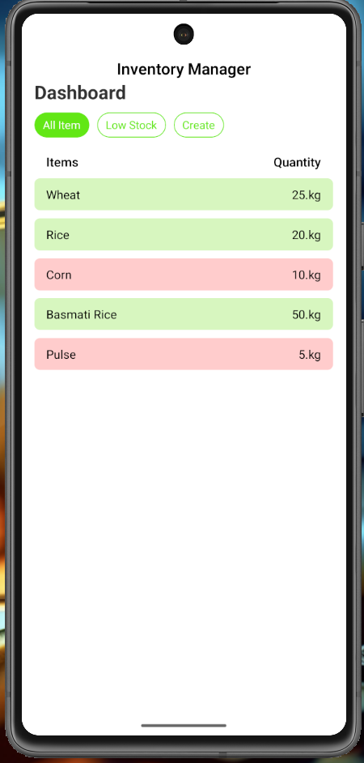
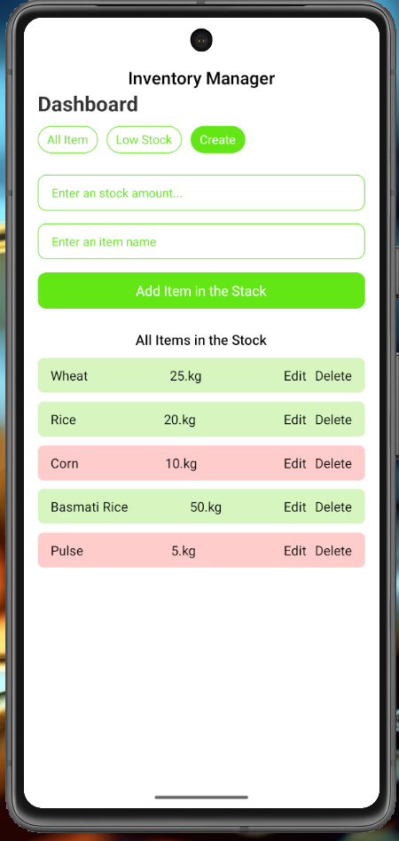

# 🛒 Inoventry Manager

A React Native app that helps store owners easily manage their grocery inventory — add, edit, delete products, and monitor stock levels (low/high). Built using React Native with intuitive UI and smooth functionality.

---

## 📱 Features

- ➕ Add new grocery products
- ✏️ Edit existing product details
- ❌ Delete products from stock
- 📦 View complete stock list
- 📉 Check low-stock and high-stock items

---

## 📸 Screenshots

| Home Screen | Low Product | Create New And Edit Product |
|-------------|-------------|--------------|
|  |  |  |

> Place your screenshots in a `screenshots` folder in the root of your project.

---


## 📦 Tech Stack

- React Native
- state management

---

## 🛠️ Installation

```bash
git clone https://github.com/AslamKhanpathan142/inoventry-grocery-manager-with-react-native.git
cd inoventry-grocery-manager-with-react-native
npm install
npx react-native run-android
